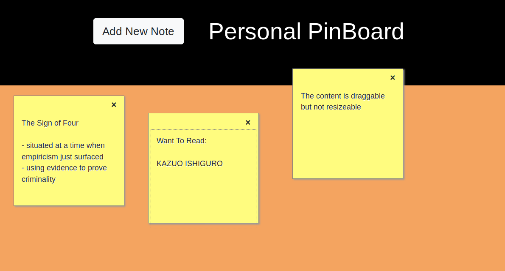

# :bookmark: sticky-note :bookmark:
A sticky note application on the web

The project has been deployed with surge: [pin.surge.sh](https://pin.surge.sh)

## :seedling: Additional Features (Future Work)
- Resizing notes
- Changing font size and font family
- A nicer background image helps

## :hibiscus: Thank you

:exclamation: [Tyler Feliz](https://www.admixweb.com/create-a-posticks-sticky-notes-app-with-html5-css3-and-jquery/) wrote an awesome guide. I simplified a lot of the JS to make it more understandable :exclamation:
